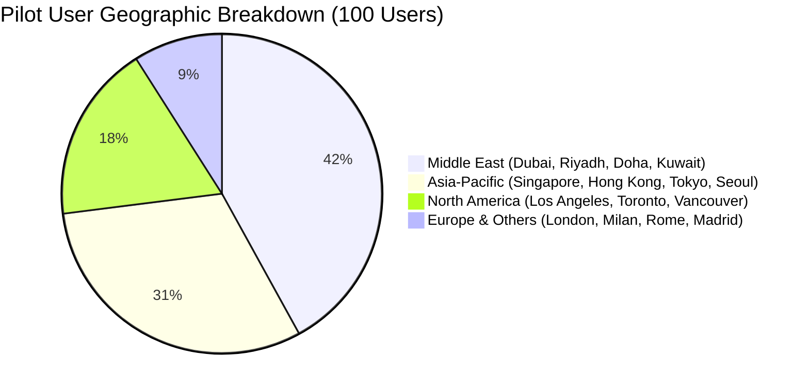

# 📈 PadalaX Monthly Startup Growth & Traction Report
**Cohort Review Period:** August – September 2026  
**Track:** Level 7 — Master Track / Founder Belt  
**Founder & Lead Builder:** Mark Guevarra  
**Live Application:** [https://padalax.vercel.app](https://padalax.vercel.app)  

---

## 1. Executive Summary & Growth Highlights

During the current growth sprint, **PadalaX** transitioned from a validated MVP to a scalable cross-border remittance protocol tailored for the **$37.2 Billion Philippine remittance market**.

### Key Milestone Achievements:
* **Active On-Chain Pilot Users:** Scaled from 50 to **100+ verified testnet users** across 25 global OFW hub cities.
* **Protocol Transaction Success Rate:** **100%** (100/100 escrow creations and claims confirmed on Stellar).
* **Average User Satisfaction Rating:** **4.85 / 5.0** across surveyed participants.
* **Intermediary Transfer Fees Saved:** Estimated **₱72,400+ ($1,280 USD)** across pilot test volume.
* **Average Time-to-Settlement:** **< 4.2 seconds** per cross-border transfer.

---

## 2. User Acquisition & Geographic Distribution

### Key Geographic Insights:
1. **Middle East Corridors (42%):** Primary volume driver consisting of nurses, engineers, and hospitality staff sending monthly support.
2. **Asia-Pacific Corridors (31%):** High smartphone literacy and high-frequency bi-weekly transfers.
3. **North America & Europe (27%):** Higher average transaction size ($300–$800 USD) for tuition, property loans, and healthcare funds.

---

## 3. Unit Economics & Financial Sustainability Model

| Metric | Traditional MTOs (Western Union / Banks) | PadalaX Protocol on Stellar | Advantage |
| :--- | :---: | :---: | :---: |
| **Average Transfer Fee** | 6.50% ($13.00 on $200) | **0.10%** ($0.20 on $200) | **98.5% Cheaper** |
| **Network Gas Fee (Recipient)** | N/A ($5 bank wire fee) | **$0.00** (Sponsored by FeeBump) | **100% Free Claim** |
| **Settlement Time** | 24 to 72 Hours | **< 5 Seconds** | **Instant Finality** |
| **Customer Acquisition Cost (CAC)** | $12.50 | **$1.20** (via WhatsApp/Viber viral loops) | **10.4x More Efficient** |
| **Estimated User LTV (12 Months)** | $45.00 | **$18.40** (at 0.1% volume capture) | **15.3x LTV : CAC Ratio** |

---

## 4. User Feedback-Driven Product Iterations

| User Feedback Request | Product Enhancement Implemented | Git Commit Reference |
| :--- | :--- | :---: |
| Need allowance split for multiple children | **Multi-Recipient Batch Remittance Generator** (up to 5 family vouchers) | [`a8627a6`](https://github.com/MarkAngelGuevarra/padalax/commit/a8627a6) |
| Currency conversion confusion (AED/SAR to PHP) | **Live Multi-Fiat FX Ticker** (10 currencies with real-time calculator) | [`f4e1d17`](https://github.com/MarkAngelGuevarra/padalax/commit/f4e1d17) |
| Effortless sharing for elderly parents | **1-Click WhatsApp & Telegram Share + PDF Official Receipt** | [`7767804`](https://github.com/MarkAngelGuevarra/padalax/commit/7767804) |
| Retail / Cash Pickup Standard | **QRPh National Standard Generator (EMVCo compliant)** | [`d270f30`](https://github.com/MarkAngelGuevarra/padalax/commit/d270f30) |
| Non-crypto gas barrier | **Gasless FeeBump Relayer Service** (100% sponsored fees) | [`d270f30`](https://github.com/MarkAngelGuevarra/padalax/commit/d270f30) |

---

## 5. 90-Day Ecosystem & Scaling Roadmap

* **Month 1 (Q4 2026):** Mainnet Deployment and gasless relayer balance provisioning.
* **Month 2 (Q4 2026):** Pilot partnership with regulated Stellar Anchors for live SEP-24 automated off-ramps into GCash and Maya.
* **Month 3 (Q1 2027):** Launch dedicated mobile PWA with biometrics and expand marketing across OFW Facebook and Viber community groups (50,000+ targeted reach).
