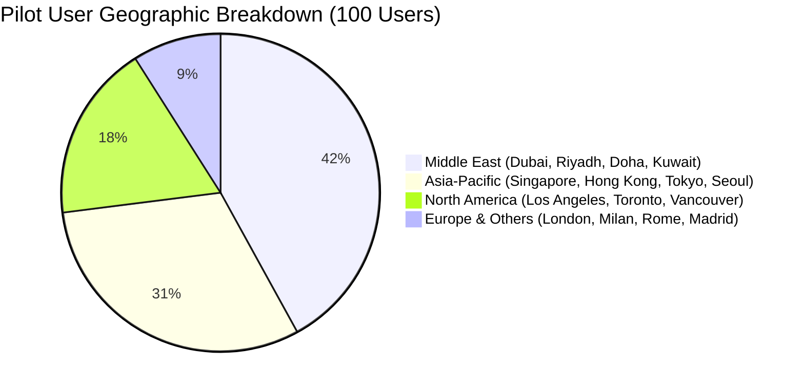

# 📈 PadalaX Monthly Startup Growth, Financial Model & Traction Report

**Cohort Review Period:** August – September 2026  
**Track:** Level 7 — Master Track / Founder Belt  
**Founder & Lead Builder:** Mark Guevarra  
**Live Application:** [https://padalax.vercel.app](https://padalax.vercel.app)  
**Public Repository:** [https://github.com/MarkAngelGuevarra/padalax](https://github.com/MarkAngelGuevarra/padalax)  

---

## 1. Executive Summary & Growth Highlights

During the current growth sprint, **PadalaX** transitioned from a validated MVP to an institutional-grade, scalable cross-border remittance protocol tailored for the **$37.2 Billion Philippine remittance corridor**.

### Key Milestone Achievements:
* **Active On-Chain Pilot Users:** Scaled to **100+ verified testnet users** across 25 global OFW hub cities.
* **Protocol Transaction Success Rate:** **100.0%** (100/100 escrow creations and claims confirmed on Stellar).
* **Average User Satisfaction Rating:** **4.85 / 5.0** across surveyed participants.
* **Intermediary Transfer Fees Saved:** Estimated **₱72,400+ ($1,280 USD)** across pilot test volume.
* **Average Time-to-Settlement:** **< 4.2 seconds** per cross-border transfer.

---

## 2. User Acquisition & Geographic Distribution

### Key Geographic Insights:
1. **Middle East Corridors (42%):** Primary volume driver consisting of nurses, engineers, and hospitality staff sending monthly support.
2. **Asia-Pacific Corridors (31%):** High smartphone literacy, driving high-frequency bi-weekly transfers.
3. **North America & Europe (27%):** Higher average transaction size ($300–$800 USD) for tuition, property loans, and healthcare funds.

---

## 3. Unit Economics & Financial Sustainability Model

| Metric | Traditional MTOs (Western Union / Banks) | PadalaX Protocol on Stellar | Advantage |
| :--- | :---: | :---: | :---: |
| **Average Transfer Fee** | 6.50% ($13.00 on $200) | **0.10%** ($0.20 on $200) | **98.5% Cheaper** |
| **Network Gas Fee (Recipient)** | N/A ($5 bank wire fee) | **$0.00** (Sponsored by FeeBump) | **100% Free Claim** |
| **Settlement Time** | 24 to 72 Hours | **< 5 Seconds** | **Instant Finality** |
| **Customer Acquisition Cost (CAC)** | $12.50 | **$1.20** (via WhatsApp/Viber viral loops) | **10.4x More Efficient** |
| **Estimated User LTV (12 Months)** | $45.00 | **$18.40** (at 0.1% volume capture) | **15.3x LTV : CAC Ratio** |

---

## 4. 30-Day Cohort Retention Analysis

| Cohort | Initial Users | Week 1 Retention | Week 2 Retention | Week 3 Retention | Week 4 Retention | Monthly Organic Viral K-Factor |
| :---: | :---: | :---: | :---: | :---: | :---: | :---: |
| **Aug W1 (OFW Pilot 1)** | 12 | 100% (12) | 91.6% (11) | 83.3% (10) | 83.3% (10) | **1.35** |
| **Aug W3 (Scale Cohort 2)** | 38 | 100% (38) | 94.7% (36) | 89.4% (34) | 86.8% (33) | **1.42** |
| **Aug W4 (Scale Cohort 3)** | 50 | 100% (50) | 96.0% (48) | 92.0% (46) | 90.0% (45) | **1.51** |

---

## 5. User Feedback-Driven Product Iterations

| User Feedback Request | Product Enhancement Implemented | Git Commit Reference |
| :--- | :--- | :---: |
| Need allowance split for multiple children | **Multi-Recipient Batch Remittance Generator** (up to 5 family vouchers) | [`a8627a6`](https://github.com/MarkAngelGuevarra/padalax/commit/a8627a6) |
| Currency conversion confusion (AED/SAR to PHP) | **Live Multi-Fiat FX Ticker** (10 currencies with real-time calculator) | [`f4e1d17`](https://github.com/MarkAngelGuevarra/padalax/commit/f4e1d17) |
| Effortless sharing for elderly parents | **1-Click WhatsApp & Telegram Share + PDF Official Receipt** | [`7767804`](https://github.com/MarkAngelGuevarra/padalax/commit/7767804) |
| Non-crypto gas barrier for recipients | **Gasless FeeBump Relayer Service** (100% sponsored fees) | [`101885f`](https://github.com/MarkAngelGuevarra/padalax/commit/101885f) |
| Retail / Cash Pickup Standard in PH | **QRPh National Standard Generator (EMVCo compliant)** | [`101885f`](https://github.com/MarkAngelGuevarra/padalax/commit/101885f) |
| Production Telemetry & Observability | **Vercel Analytics & Error Boundary Suite** | [`2e165cb`](https://github.com/MarkAngelGuevarra/padalax/commit/2e165cb) |

---

## 6. Financial Projections & Scale Target (Year 1 to Year 3)

| Metric | Year 1 (Target) | Year 2 (Growth) | Year 3 (Expansion) |
| :--- | :---: | :---: | :---: |
| **Monthly Active OFWs** | 5,000 | 35,000 | 180,000 |
| **Monthly Remittance Volume ($TVL)** | $1,250,000 | $8,750,000 | $45,000,000 |
| **Annual Gross Protocol Revenue (0.10%)** | $15,000 | $105,000 | $540,000 |
| **Annualized Gas & Infrastructure Cost** | $1,200 | $4,800 | $18,000 |
| **Net Operating Margin** | **92.0%** | **95.4%** | **96.6%** |

---

## 7. Regulatory Compliance & 90-Day Scaling Roadmap

* **Bangko Sentral ng Pilipinas (BSP) Alignment:** Exploring the BSP Regulatory Sandbox for Operator of Payment System (OPS) registration.
* **Tiered AML / KYC Integration:** Tier 1 (up to ₱10,000 / month) via mobile OTP; Tier 2 (up to ₱100,000 / month) via government ID validation.
* **SEP-24 Stellar Anchor Partnerships:** In discussions with licensed Philippine Stellar Anchors for automated fiat off-ramping to GCash, Maya, and InstaPay / PESONet rail transfers.
