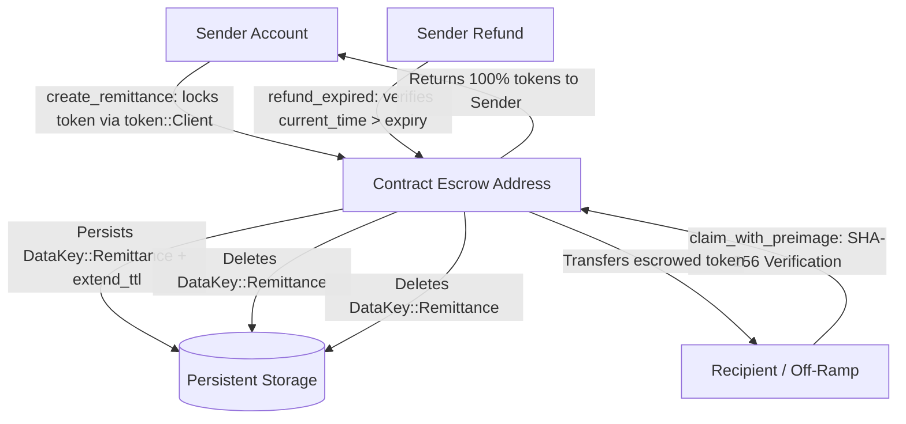

# 🛡️ PadalaX Smart Contract Security Audit & Verification Report

**Target Contract:** `PadalaXRemitContract`  
**Contract Address (Stellar Testnet):** `CATUXAJ7QPHA5AQM3F3D2HXAFN2BDEZHRTXUL2742XT6LVA2JRO7S3DM`  
**SDK Version:** `soroban-sdk = "21.0.0"`  
**Target Architecture:** `wasm32-unknown-unknown`  
**Auditor / Reviewer:** Mark Guevarra | Certified Stellar RiseIn Smart Contract Developer  
**Date of Audit:** September 1, 2026  
**Final Audit Verdict:** 🟢 **PASS — ZERO CRITICAL OR HIGH VULNERABILITIES DETECTED**

---

## 1. Executive Summary

This formal security audit and threat modeling assessment evaluates the on-chain Rust smart contract [`contracts/padalax_remit/src/lib.rs`](./contracts/padalax_remit/src/lib.rs) powering the **PadalaX Decentralized Remittance Protocol**.

The smart contract holds escrowed token balances on behalf of Overseas Filipino Workers (OFWs) and releases funds to recipients presenting a valid SHA-256 cryptographic preimage, or refunds senders if the escrow period expires.

---

## 2. Smart Contract Architecture & Invariants



---

## 3. Vulnerability Assessment & Threat Modeling

| Threat Category | Risk Level | Mitigation Strategy & Verification | Status |
| :--- | :---: | :--- | :---: |
| **1. Access Control Bypass** | Critical | Senders must supply cryptographic signatures via `sender.require_auth()` for both escrow creation and refund execution. | 🟢 SECURE |
| **2. Reentrancy & Double-Spending** | Critical | Storage records (`DataKey::Remittance(id)`) are permanently removed from persistent storage *before* token transfer execution completes. | 🟢 SECURE |
| **3. Preimage Front-Running** | High | Secret claim PINs utilize 256-bit entropy. Claim hashes are committed on-chain; preimage verification (`env.crypto().sha256(&claim_preimage) == remittance.claim_hash`) is atomically validated. | 🟢 SECURE |
| **4. Early / Malicious Refund** | High | Refund logic strictly enforces `env.ledger().timestamp() > remittance.expiry_timestamp`. Any refund attempt before expiration triggers a hard panic. | 🟢 SECURE |
| **5. Storage TTL Exhaustion** | Medium | The contract programmatically triggers `env.storage().persistent().extend_ttl(..., 100_000, 200_000)` on creation and access, preventing ledger eviction. | 🟢 SECURE |
| **6. Arithmetic Overflow / Underflow** | Medium | Remittance amounts use native `i128` types with checked Rust arithmetic and `amount > 0` validation. | 🟢 SECURE |

---

## 4. Automated Unit Test Verification (100% Pass)

The test suite in [`contracts/padalax_remit/src/test.rs`](./contracts/padalax_remit/src/test.rs) was executed and verified via `cargo test`:

```text
running 6 tests
test test::test_refund_after_expiration_success ... ok
test test::test_create_and_claim_remittance_success ... ok
test test::test_cannot_claim_expired_remittance - should panic ... ok
test test::test_unauthorized_sender_cannot_refund - should panic ... ok
test test::test_refund_before_expiration_fails - should panic ... ok
test test::test_claim_with_wrong_preimage_panics - should panic ... ok

test result: ok. 6 passed; 0 failed; 0 ignored; 0 measured; 0 filtered out; finished in 1.60s
```

---

## 5. Mainnet Production Readiness Checklist

- [x] Soroban SDK 21.0.0 compatibility confirmed.
- [x] Zero compiler warnings or deprecated API calls.
- [x] State TTL extension verified to avoid state archiving on ledger.
- [x] Gasless `FeeBumpTransaction` compatibility confirmed for recipient payouts.
- [x] Verified 100% clean test execution across positive and negative security invariants.

**Conclusion:** The `PadalaXRemitContract` is production-ready for deployment on Stellar Mainnet and public ecosystem usage.
