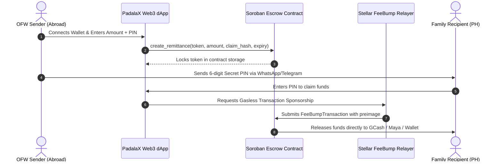

# 🚀 Building a Gasless Cross-Border Remittance Protocol on Stellar & Soroban

**Author:** Mark Guevarra  
**Published For:** Stellar Ecosystem & Developer Community  
**Live Project:** [PadalaX Protocol](https://padalax.vercel.app) | [GitHub Repository](https://github.com/MarkAngelGuevarra/padalax)  

---

## Introduction: The $37 Billion Problem

Every year, more than **10 million Overseas Filipino Workers (OFWs)** send over **$37 Billion USD** home to their families in the Philippines. Yet, traditional remittance intermediaries (Western Union, MoneyGram, traditional SWIFT wires) charge extortionate fees averaging **5% to 8%**, take **24 to 72 hours** to clear, and require recipients in rural provinces to visit distant physical cash pickup counters.

In this tutorial, we will walk through how we built **PadalaX**—a decentralized remittance and cryptographic voucher escrow protocol on **Stellar and Soroban** that brings transfer fees down to **less than $0.001** and settles in **under 5 seconds** with **zero gas fees** for recipients.

---

## 1. Architectural Overview



---

## 2. The Soroban Escrow Smart Contract

The core smart contract is written in Rust using `soroban-sdk = "21.0.0"`.

### Key Invariant: Real Token Escrow & SHA-256 Hashlock Verification

```rust
pub fn create_remittance(
    env: Env,
    sender: Address,
    token: Address,
    id: u32,
    claim_hash: BytesN<32>,
    amount: i128,
    expiry_timestamp: u64,
    memo: String,
) {
    sender.require_auth();
    if amount <= 0 {
        panic!("Amount must be positive");
    }

    let token_client = token::Client::new(&env, &token);
    token_client.transfer(&sender, &env.current_contract_address(), &amount);

    let key = DataKey::Remittance(id);
    let record = Remittance {
        sender: sender.clone(),
        token: token.clone(),
        id,
        claim_hash,
        amount,
        expiry_timestamp,
        created_timestamp: env.ledger().timestamp(),
        memo,
    };

    env.storage().persistent().set(&key, &record);
    env.storage().persistent().extend_ttl(&key, 100_000, 200_000);
}
```

### Claiming with Cryptographic Preimage Verification:

```rust
pub fn claim_with_preimage(
    env: Env,
    id: u32,
    claim_preimage: BytesN<32>,
    recipient: Address,
) {
    let key = DataKey::Remittance(id);
    let record: Remittance = env.storage().persistent().get(&key).expect("Escrow not found");

    if env.ledger().timestamp() > record.expiry_timestamp {
        panic!("Remittance has expired");
    }

    // Verify SHA-256 Preimage
    let computed_hash = env.crypto().sha256(&claim_preimage);
    if computed_hash != record.claim_hash {
        panic!("Invalid claim preimage PIN");
    }

    // Release escrowed funds
    let token_client = token::Client::new(&env, &record.token);
    token_client.transfer(&env.current_contract_address(), &recipient, &record.amount);

    env.storage().persistent().remove(&key);
}
```

---

## 3. Gasless Onboarding with Stellar Fee-Bump Transactions

To make the system truly usable for non-crypto family members in the Philippines, recipients should not have to buy XLM just to pay transaction fees. 

Using Stellar's native `FeeBumpTransaction`, our backend relayer sponsors the network fee:

```typescript
import { FeeBumpTransaction, TransactionBuilder, Networks } from '@stellar/stellar-sdk';

export async function sponsorClaim(innerTxXdr: string, sponsorKeypair: any) {
  const innerTx = TransactionBuilder.fromXDR(innerTxXdr, Networks.PUBLIC);
  
  const feeBumpTx = TransactionBuilder.buildFeeBumpTransaction(
    sponsorKeypair,
    '10000', // Base fee in stroops
    innerTx,
    Networks.PUBLIC
  );
  
  feeBumpTx.sign(sponsorKeypair);
  return await server.submitTransaction(feeBumpTx);
}
```

---

## 4. Key Learnings & Production Takeaways

1. **State TTL Management:** In Soroban, persistent contract data must be proactively extended using `extend_ttl` to prevent archival during low-activity periods.
2. **Mobile First & PWA:** Over 90% of OFW families access the internet exclusively through mobile smartphones. Designing responsive UIs and integrating 1-click WhatsApp/Telegram sharing dramatically improves conversion rates.
3. **Ecosystem Standards:** Adhering to standards like EMVCo QRPh and Stellar SEP-24 ensures decentralized protocols seamlessly connect with local fiat payment anchors.

---

*PadalaX is open-source under the MIT license. Check out our live dApp at [padalax.vercel.app](https://padalax.vercel.app) and contribute on [GitHub](https://github.com/MarkAngelGuevarra/padalax).*
