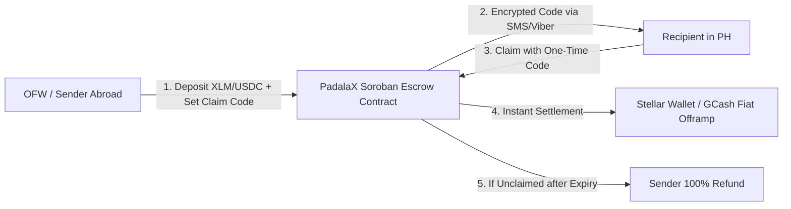

# 🇵🇭 PadalaX: Decentralized Cross-Border Remittance & Voucher Escrow Protocol
**Stellar RiseIn Bootcamp — Idea & Project Proposal Submission**

---

## 1. Executive Summary & Problem Statement
Over **10 million Overseas Filipino Workers (OFWs)** send more than **\$37 Billion USD** in remittances back to the Philippines every year. However, traditional remittance corridors (Western Union, MoneyGram, traditional SWIFT wire transfers) charge exorbitant fees averaging **5% to 8% per transaction**, coupled with predatory foreign exchange markups and 1–3 day settlement delays.

**PadalaX** is a next-generation decentralized remittance and cryptographic voucher escrow protocol built on **Stellar and Soroban**. It reduces cross-border transfer fees to less than **\$0.001 (fractions of a cent)**, settles transactions in **under 5 seconds**, and provides unbanked recipients in the Philippines with instant cryptographic claim codes for direct fiat off-ramping (GCash, Maya, and local bank transfers).

---

## 2. Core Value Proposition & Key Features

### Key Architectural Pillars:
1. **Zero-Friction Escrow (HashLock Claim Codes):** Senders deposit funds locked with a SHA-256 hash preimage. Recipients do not even need a pre-existing Web3 wallet to receive funds—they simply redeem the one-time code generated by the sender.
2. **Time-Locked Safety & Autonomous Refunds:** Every remittance includes a configurable expiration period (e.g., 7 days). If unclaimed, the sender can trigger a 100% refund with a single click.
3. **Gasless Onboarding (Stellar Fee-Bump Relayer):** Recipients pay \$0 in network gas fees to claim their money.
4. **Instant Fiat Off-Ramp Integration:** Direct architectural compatibility with Stellar Anchor SEP-24 rails connecting to GCash, Maya, and InstaPay.

---

## 3. Technical Architecture on Soroban & Stellar

| Layer | Technology | Purpose |
| :--- | :--- | :--- |
| **Settlement Layer** | Stellar Mainnet / Testnet | Sub-second consensus and multi-currency path payments. |
| **Smart Contract** | Soroban (Rust) | Stateful voucher escrow, claim verification, and refund logic. |
| **Relayer** | Stellar `FeeBumpTransaction` | Gasless transaction fee sponsorship. |
| **Client** | React + Vite + TypeScript | High-converting mobile-first PWA for senders and recipients. |

---

## 4. Belt Progression Roadmap

* **⚪ Level 1 (White Belt):** Stellar SDK wallet generation, Testnet account funding via Friendbot, and automated payment/memo transfers.
* **🟡 Level 2 (Yellow Belt):** Soroban smart contract scaffolding in Rust, core escrow logic, and local test compilation (`cargo test`).
* **🟠 Level 3 (Orange Belt):** Stateful data modeling, cryptographic hash-preimage verification, time-locked expiration, and strict `require_auth()` access control.
* **🟢 Level 4 (Green Belt):** Web3 frontend integration with Freighter wallet connection and pre-flight RPC simulation.
* **🔵 Level 5 (Blue Belt):** Dynamic QR voucher generation, real-time PHP/USD currency converter, protocol telemetry dashboard, and pilot user testing.
* **⚫ Level 6 (Black Belt):** Public Stellar Mainnet deployment, gasless relayer infrastructure, and security audit report.
* **💖 Level 7 (Master Track):** Live SEP-24 / GCash off-ramp interface and production scaling.
